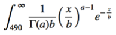

#### Long-lasting batteries (most-expensive) VS short-term batteries (least expensive)

- Long-lasting batteries lifetime follows an exponential distribution with a mean of 1000 hours.
- Short-term batteries lifetime follows a gamma distribution with a mean of 500 hours, and a variance of 200 hours.
- For every short-term battery produced, four long-lasting batteries are produced.

Long-lasting batteries:  
  X ~ Exponential(1000,1000^2)  
  β = 1000  
  Probability that the batteries last at least 490 is a right-tailed test  
  P(X ≥ 490) = e-490/1000 = 0.612626… => 61.26%  

Short-term batteries:  
  X ~ Gamma(500,200)  
  Standard deviation (σ) is 14.1421  
  The scale parameter is 200/500 (or 0.4), with a rate of 2.5  
  The shape parameter is 500/0.4 (mean divided by the scale parameter)  
   
