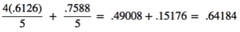

### Long-lasting batteries (most-expensive) VS short-term batteries (least expensive)

- Long-lasting batteries lifetime follows an exponential distribution with a mean of 1000 hours.
- Short-term batteries lifetime follows a gamma distribution with a mean of 500 hours, and a variance of 200 hours.
- For every short-term battery produced, four long-lasting batteries are produced.

#### Long-lasting batteries:  
  X ~ Exponential(1000,1000^2)  
  β = 1000  

#### Short-term batteries:  
  X ~ Gamma(500,200)  
  Standard deviation (σ) is 14.1421  
  The scale parameter is 200/500 (or 0.4), with a rate of 2.5  
  The shape parameter is 500/0.4 (mean divided by the scale parameter)  

#### Probability that a battery (picked from random) lasts at least 490 hours.  
*Long-lasting Batteries:* Probability that the batteries last at least 490 is a right-tailed test  
P(X ≥ 490) = e-490/1000 = 0.612626… => 61.26%  
*Short-term Batteries:* Gamma distribution (below)     
  
The integral for the short-term batteries equates to 0.758795.. => 75.88%  
*Probability that the battery lasts at least 490 hours:*   
 = ~64.18%  

#### Probability that a battery (picked from random) lasts at least 490 hours AND is a short-term battery.  
Knowing that picking a short-term battery is 75.88%, a 1-in-5 (20%) chance of picking a short-term batteries estimates a (0.2 * 0.7588) 15.18% chance.  
Then factoring in that a short-term battery lasted at least 490 hours: 15.18% / 64.18% = 23.65%
This was approached using Bayes Theorem.

### Are more than 80% of Americans right handed?
Sample size: 500; 419 of those were right-handed
#### Hypothesis:  
H0: p = 80%  H1: p > 80%  
#### P-value for test:
The sample size is greater than 30, and using a significant level of .05, the z-score test statistic is:  
  
The p-value is = P (Z > 2.12) = 1 - .9830 = 0.017
(used the Z-table from http://www.stat.ufl.edu/~athienit/Tables/Ztable.pdf)
#### Conclusion:
Since the p-value is less than or equal to the significant level (α) of .05, H0 is rejected.
There is significant evidence to support that more than 80% of Americans are right-handed, with a significant level of 0.05.
