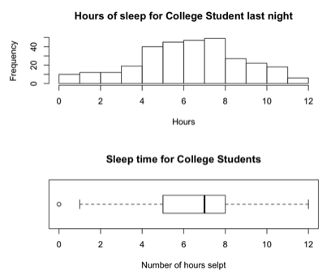
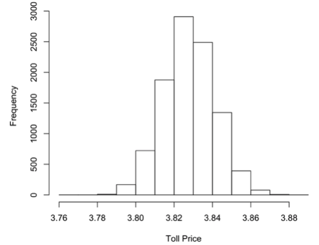

### Determining the hours of sleep for college students for one night
 - Removed three erroneous data points:
  	1. person: 101, hours: 70
  	2. person: 151, hours: 50
  	3. person: 250, hours: -5
- A total sample of 307 college students remains, instead of 310.

```R
sleepData <- read.table("sleepData.txt", header = T)

par(mfrow=c(2,1))
hist(sleepData[,2], breaks = 12, main ="Hours of sleep for College Student last night", xlab ="Hours")
boxplot(sleepData[,2], horizontal = TRUE, xlab="Number of hours selpt", main="Sleep time for College Students")
```



The histogram shows that a student typically slept 5 to 8 hours, with the highest percentage of the student receiving 7 hours of sleep. The histogram does not show the student which didn’t sleep at all. With the box-plot, it shows the zero hours slept as well as the median and mean (though they are very closely related). It also shows the “middle 50%” between the 1st and 3rd quartile range.

#### Summary of sleep data
`summary(sleepData)`

|         | person  | hours   |
| :----   | :----   |:----    |
| Min.    | 1.0     | 0.000   |
| 1st Qu. | 77.5    |	5.000   |
| Median  | 155.0   |	7.000   |
| Mean    | 155.4   |	6.739   |
| 3rd Qu. | 232.5   | 8.000   |
| Max.    | 310.0   | 12.000  |

A value that initially sticks out immediately is the max value of 310, which is incorrect since there is only 307 data values after removing the 3 errors. Though the main information desired is the data based around the hours of sleep. The mean is more specific here as it was difficult to see on the box-plot. It also confirms the whole number values for which the box-plot portrayed. While the histogram showed the frequency “at-a-glance”, the box-plot provided more visual information which more mimics the summary information above.


### Toll through-put during different traffic patterns
Upfront:  I believe it’s fair to assume that there is no traffic jams and the flow of traffic does not slow during the rush hour times. Other factors such as wrecks, construction, or other delays are also ignored. 

```R
#chance of having more than 325 vehicles per 30 min, during rush hour (7AM-10AM, 4PM-7PM)
#the average is 10/min, the chances of having more than 325 in a 30 minute period:
ppois((325/30), lambda = 10, lower=FALSE) 
```
[1] 0.4169602   

```R
#chance of having more than 325 vehicles per 30 min, during non-rush hour (10AM-4PM)
#the average is 3/min, the chances of having more than 325 in a 30 minute period
ppois((325/30), lambda = 3, lower=FALSE) 
```
[1] 0.000292337  

```R
#chance of having more than 325 vehicles per 30 min, during all other hours
#the average is 8/hr, the chances of having more than 325 in a 30 minute period
ppois((325/30), lambda = 8/60, lower=FALSE)
```
[1] 5.249437e-18  

#### Average price paid at tolls
```R
tollPriceList<-0

 for(i in 1:10000){
  
 #random number of vehicles in a 30 minutes window, during rush hours
 VEH1 = sum(rpois(30, 10))
 VEH2 = sum(rpois(30, 10))
 VEH3 = sum(rpois(30, 10))
 VEH4 = sum(rpois(30, 10))
 VEH5 = sum(rpois(30, 10))
 VEH6 = sum(rpois(30, 10))
 VEH7 = sum(rpois(30, 10))
 VEH8 = sum(rpois(30, 10))
 VEH9 = sum(rpois(30, 10))
 VEH10 = sum(rpois(30, 10))
 VEH11 = sum(rpois(30, 10))
 VEH12 = sum(rpois(30, 10))
 VEHSUM = sum(VEH1+VEH2+VEH3+VEH4+VEH5+VEH6+VEH7+VEH8+VEH9+VEH10+VEH11+VEH12)

 #random number of vehicles in a 30 minutes window, during non rush hours
 VHNR1 = sum(rpois(30, 3))
 VHNR2 = sum(rpois(30, 3))
 VHNR3 = sum(rpois(30, 3))
 VHNR4 = sum(rpois(30, 3))
 VHNR5 = sum(rpois(30, 3))
 VHNR6 = sum(rpois(30, 3))
 VHNR7 = sum(rpois(30, 3))
 VHNR8 = sum(rpois(30, 3))
 VHNR9 = sum(rpois(30, 3))
 VHNR10 = sum(rpois(30, 3))
 VHNR11 = sum(rpois(30, 3))
 VHNR12 = sum(rpois(30, 3))
 VHNRSUM = sum(VHNR1+VHNR2+VHNR3+VHNR4+VHNR5+VHNR6+VHNR7+VHNR8+VHNR9+VHNR10+VHNR11+VHNR12)

 #random number of vehicles in a 30 minutes window, during other hours outside 7AM to 7PM
 VHELSE1 = sum(rpois(60, 8/60))
 VHELSE2 = sum(rpois(60, 8/60))
 VHELSE3 = sum(rpois(60, 8/60))
 VHELSE4 = sum(rpois(60, 8/60))
 VHELSE5 = sum(rpois(60, 8/60))
 VHELSE6 = sum(rpois(60, 8/60))
 VHELSE7 = sum(rpois(60, 8/60))
 VHELSE8 = sum(rpois(60, 8/60))
 VHELSE9 = sum(rpois(60, 8/60))
 VHELSE10 = sum(rpois(60, 8/60))
 VHELSE11 = sum(rpois(60, 8/60))
 VHELSE12 = sum(rpois(60, 8/60))
 VHOTHERSUM = sum(VHELSE1+VHELSE2+VHELSE3+VHELSE4+VHELSE5+VHELSE6+VHELSE7+VHELSE8+VHELSE9+VHELSE10+VHELSE11+VHELSE12)


 #1-4wheels, 2-semi (more than 4 wheels)
 fourWheelRushHour = sample(0:1, size=VEHSUM, replace=TRUE, prob=c(.25,.75))
 sum(fourWheelRushHour)
 semiTruckRushHour = VEHSUM - sum(fourWheelRushHour)

 fourWheelNonRushHour = sample(0:1, size=VHNRSUM, replace=TRUE, prob=c(.25,.75))
 sum(fourWheelNonRushHour)
 semiTruckNonRushHour = VHNRSUM - sum(fourWheelNonRushHour)

 fourWheelOtherHour = sample(0:1, size=VHOTHERSUM, replace=TRUE, prob=c(.25,.75))
 sum(fourWheelOtherHour)
 semiTruckOtherHour = VHOTHERSUM - sum(fourWheelOtherHour)

 totalCars=sum(fourWheelRushHour)+
   semiTruckRushHour+
   sum(fourWheelNonRushHour)+
   semiTruckNonRushHour+
   sum(fourWheelOtherHour)+
   semiTruckOtherHour

 totalTollPaid = (sum(fourWheelRushHour)*3*(1-.417))+(sum(fourWheelRushHour)*(3*1.25)*(.417))+
 (sum(semiTruckRushHour)*5*(1-.417))+(sum(semiTruckRushHour)*(5*1.25)*(.417))+
 (sum(fourWheelNonRushHour)*3*(1-.417))+(sum(fourWheelNonRushHour)*(3*1.25)*(.417))+
 (sum(semiTruckNonRushHour)*5*(1-.0003))+(sum(semiTruckNonRushHour)*(5*1.25)*(.0003))+
 (sum(fourWheelOtherHour)*3)+
 (sum(semiTruckOtherHour)*5)

 #average price
 tollPriceList[i] = (totalTollPaid/totalCars)

}

mean(tollPriceList)
sd(tollPriceList)
```
`> mean(tollPriceList)`
	[1] 3.828294  
`> sd(tollPriceList)`
	[1] 0.01317745

I then sampled a random set given the averages of 10/min vehicles during rush hour, 3/min during between 10AM and 4PM, and 3/hr otherwise. For the 3/hr, I simply factored it over an hour instead of 30 minutes since it is extremely unlikely that there will be more than 325 cars in 30 minutes. I did this for only one day, not for 5 times to consider 5 days. If I did this, the other prices resulted in:   
		`$3.83, $3.83, $3.85, $3.84, $3.82, $3.83, $3.84, etc.`  
For this, a for loop was placed to run the code and store it into an array. These numbers resemble each other very closely. Rough example below:


